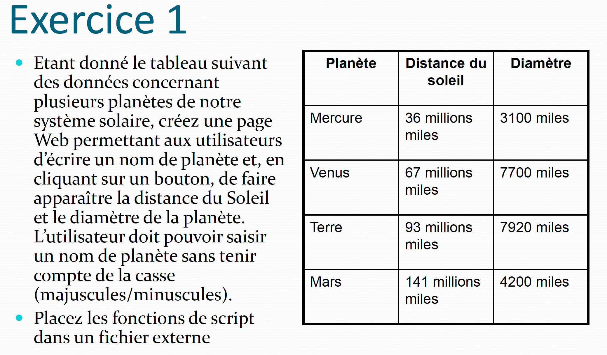
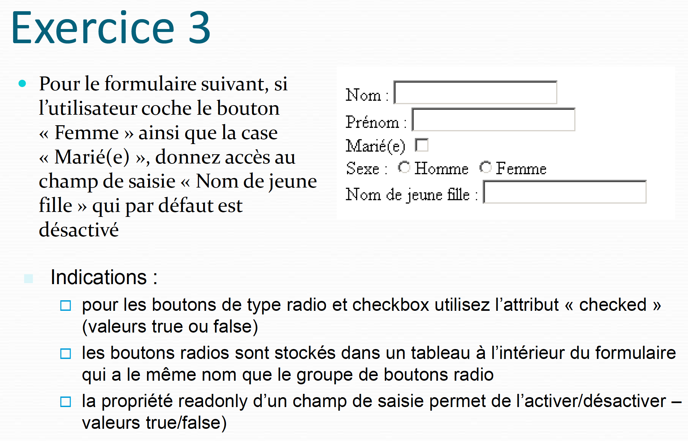

# Résumé exo corrigé javascript Master CIM

## Cours 1

### Exercice 2
Ecrivez un programme en JavaScript qui demande à
l’utilisateur une valeur entre 1 et 100 et qui affiche soit
la valeur si elle est correcte (entre 1 et 100), soit un
message d’erreur si la valeur n’est pas correcte.

````js
let value = prompt("Entrez une valeur entre 1 et 100");

if(value<1 || value>100) {
    alert('Erreur - Vous devez entrer une valeur comprise entre 1 et 100');
} else {
    alert(`La valeur ${value} est corecte`);
}
````

## Cours 2

### Exercice 3
* Ecrire un programme qui calcule le nombre
d’occurrences d’une lettre dans une chaîne de
caractères. La lettre à rechercher et la chaîne sont
rentrées par l’utilisateur.
* Utilisez la propriété length qui donne la taille d’une
chaine de caractères et la fonction **_charAt(position)_**
qui retourne le caractère qui se trouve à la position
indiquée par la variable position.
* Exemples : **_chaine.length_**, **_chaine.chartAt(nPos)_**

````javascript

let lettre = prompt("Veuillez Saissir la lettre a rechercher dans la chaine: ","a");
let chaine = prompt("Veuillez Saissir la chaine : ","aabcdadesaaa");
let nbOccurrences=0;
for (let i=0; i<chaine.length;i++){
    if(chaine.charAt(i)===lettre) nbOccurrences++;
}

document.write(`Le Nombre d'occurrences de la lettre :<strong> ${lettre}</strong> dans la chaine: <strong>${chaine}</strong> est de <strong>${nbOccurrences}</strong>`)
````
### Exercice 4

<p>
    Pour une variable de type chaîne de caractères :
    <samp>strEmail = "Robert.Martin@france.fr"</samp>
</p>
<ol>
    <li>Afficher la position du caractère @.</li>
    <li>Remplacez « france » par « yahoo » dans l’adresse e-mail.</li>
    <li>Afficher l’adresse avec toutes les caractères en minuscules</li>
    <li>Afficher l’adresse avec toutes les caractères en majuscules</li>
    <li>Affichez la fin de la chaîne à partir du caractère « @ ».</li>
    <li>Afficher la dernière position de la lettre ‘o’</li>
</ol>

````javascript
let strEmail = "Robert.Martin@france.fr";

var position_at=strEmail.indexOf("@");
document.write(`La position du caractère '@'.: <strong>${position_at}</strong>` )
var new_str_france=strEmail.replace("france", "yahoo");
document.write("<br/>")
document.write(`Remplacez « france » par « yahoo » dans l’adresse e-mail: <strong>${new_str_france}</strong>` )
document.write("<br/>")
document.write(`Afficher l’adresse avec toutes les caractères en minuscules: <strong>${new_str_france.toLowerCase()}</strong>` )
document.write("<br/>")
document.write(`Afficher l’adresse avec toutes les caractères en majuscules: <strong>${new_str_france.toUpperCase()}</strong>` )
document.write("<br/>")
document.write(`Affichez la fin de la chaîne à partir du caractère « @ ».: <strong>${new_str_france.substring(position_at)}</strong>` )
document.write("<br/>")
document.write(`Afficher la dernière position de la lettre ‘o’ (${new_str_france}): <strong>${new_str_france.lastIndexOf("o")}</strong>` )
document.write("<br/>")
document.write(`Afficher la dernière position de la lettre ‘o’(${strEmail}): <strong>${strEmail.lastIndexOf("o")}</strong>` )
````

## Cours 3
### Exercice 5

<p>
    Créez le squelette d’une page web classique (en-tête, corps).
</p>
<p>
    A l’aide de JavaScript, affectez la chaîne suivante à une variable :    
</p>

```html
<p>
 Quelques exemples
 de &lt;em>fonctions&lt;/em> de manipulation
 de &lt;em>chaines de caractères&lt;/em>.
</p>

```

Affichez la sous-chaîne commençant au 6ème caractère et finissant 6 caractères plus loin. 
Remplacer dans la chaîne la balise « **em** » par la balise « **strong** » et affichez le nombre de remplacements effectués.
Utilisez la fonction `replace()` : `chaine.replace(valeurRecherchee,nouvelleValeur)`.

Attention, la fonction replace() remplace une seule fois la chaine de caractères
````html

<script>
    let variable = `<p>Quelques exemples de <em>fonctions</em> de manipulation de <em>chaines de caractères</em>.</p>`

    document.write(variable.substring(6, 12));

    //remplace tous les occurences de la balise em
    let resultReplace=variable.replace(/em>/g, "strong>")
    document.write(resultReplace)
    console.log(resultReplace)

    //calcule nombre d'ocurence
    let decoupe= variable.split("em>");
    let nombreOccurence=decoupe.length-1;
    console.log(decoupe);
    document.write("<br>")
    document.write(`Le nombre de remplacements effectués: <strong>${nombreOccurence}</strong>`)

</script>


````

## Cours 4

## Exercice 1
<p>
    Ecrivez un script qui affiche le nom et la version du
    navigateur utilisé, ainsi que la plate-forme (le système  d’exploitation). Testez-le avec au moins 2 navigateurs.
</p>

````html
<script type="text/javascript">
    document.write("<br/><br/> <strong>Le nom du navigateur: </strong> " + navigator.appName);
    document.write("<br/><br/> <strong>La version du navigateur: </strong>" + navigator.appVersion);
    document.write("<br/><b/> <strong>Le système  d’exploitation: </strong>" + navigator.platform);
</script>
````

## Exercice 2

Affichez la définition de votre écran (en pixels) dans le format suivant :

**Ecran = largeur x hauteur**

Changez les propriétés de l’écran et re-testez votre script.

````html
<script type="text/javascript">
    document.write(
        `<br/><br/> <strong>Définition de votre écran :</strong> ${screen.height}x${screen.width}`
    );
</script>
````

## Exercice 3

<p>
    Créez rapidement 2 fichiers html : page1.html et page2.html. <br/>
    Si l’hauteur de votre écran est supérieure à 768, chargez la page1 sinon la page2.<br/>
    Indication :
    <em>pour charger la page utilisez window.location.href = "nomFichier.htm"</em>
</p>

````html
<script type="text/javascript">
    if(screen.height >= 768)
        window.location.href = "fichier1.htm"
    else 
        window.location.href = "fichier2.htm"
</script>	
````

## Cours 5

## Exercice 1

<p>
    Ecrivez une fonction verifier_email() qui est appelée suite à
    un changement dans un champ de texte et qui vérifie que le<br/>
    texte contient le symbole " @ ".
    <br/><br/>
    Affichez un message (alert)
    qui dit si l’adresse est bonne ou non.<br/><br/>
    Vous pouvez utiliser la propriété length qui donne la taille d’une
    chaine de caractères et la fonction charAt(position) qui retourne le<br/>
    caractère qui se trouve à la position indiquée par la variable position.
<br/><br/>
   <em>Exemples :</em>  <code>chaine.length, chaine.chartAt(nPos)</code><br/><br/>
    <code>
        &lt;input type="text" size="30" id="email" onchange="verifier_e_mail()">;
    </code>
    <br/>
    Indication : pour récupérer la valeur du champ utilisez:
    <code>document.nom_forme.email.value</code><br/>
    email = <strong>id</strong> de la balise <strong>input</strong> de type <strong>texte</strong> <br/>
    nom_forme = la valeur de l’attribut <strong>id</strong> ou <strong>name</strong> dans la balise <strong>form</strong>
</p>

````html

<form name="exo1">
    <label for="email">Email:</label>
    <input type="text" size="30" id="email" onchange="verifier_e_mail()">
</form>
<script>
function verifier_e_mail(){
    let emailValue=document.exo1.email.value;
    var arobaseTrouve=false
    for(var i=0; i<emailValue.length;i++){
        if(emailValue.charAt(i)==="@"){
            arobaseTrouve=true;
        }
    }
    if(arobaseTrouve)
    {
     alert("L’adresse est bonne ")
    }
    else{
        alert("L’adresse n'est pas bonne ")
    }
}

function verifier_e_mail_v2(){
    let emailValue=document.exo1.email.value;
    var arobaseIndex=emailValue.indexOf("@")

    if(arobaseIndex>-1){
        alert("L’adresse est bonne ")
    }else{
        alert("L’adresse n'est pas bonne ")
    }
}

function verifier_e_mail_v3(){
    let emailValue=document.exo1.email.value;
    var emailDecoupe=emailValue.split("@");
console.log(emailDecoupe);
    if(emailDecoupe.length>1){
        alert("L’adresse est bonne ")
    }else{
        alert("L’adresse n'est pas bonne ")
    }
}
</script>
````

## Exercice 2

<p>
    Reprenez l’exercice 1 en vérifiant que le symbole " @ "
    apparaît exactement une fois. Sinon affichez le nombre
    d’apparitions.
</p>

````html

<form name="exo1">
    <label for="email">Email:</label>
    <input type="text" size="30" id="email" onchange="verifier_e_mail()">
</form>
<script>
function verifier_e_mail(){
    let emailValue=document.exo1.email.value;
    var arobaseTrouve=false
    var arobaseCount=0;
    for(var i=0; i<emailValue.length;i++){
        if(emailValue.charAt(i)==="@"){
            arobaseTrouve=true;
            arobaseCount++;
        }
    }
    if(arobaseCount===1)
    {
     alert("L’adresse est bonne ")
    }
    else{
        alert(`L’adresse n'est pas bonne: \n Le arobase apparaît ${arobaseCount} fois`)
    }
}


function verifier_e_mail_v2(){
    let emailValue=document.exo1.email.value;
    var emailDecoupe=emailValue.split("@");
    var arobaseCount=emailDecoupe.length-1;
    if(arobaseCount===1){
        alert("L’adresse est bonne ")
    }else{
        alert(`L’adresse n'est pas bonne: \n Le arobase apparaît ${arobaseCount} fois`)
    }
}
</script>
````

## Exercice 3

<ol>

   <li style="margin-bottom: 5px">
        Reprenez l’exercice 1 en vérifiant que le symbole " @ "<br/>
        apparaît exactement une fois. Sinon affichez le nombre
        d’apparitions.
    </li>
    <li>
        Ajoutez deux champs de texte Nom et Prénom et
        vérifiez que l’adresse e-mail est bien<br/>
        nom.prénom@univ-lyon2.fr
    </li>
</ol>

````html
<form name="exo1">
    <label for="nom">Nom:</label>
    <input type="text" size="30" id="nom"><br/><br/>
    <label for="prenom">Prénom:</label>
    <input type="text" size="30" id="prenom"><br/><br/>
    <label for="email">Email:</label>
    <input type="text" size="30" id="email" onchange="verifier_e_mail()">
    <span id="email_error" style="color: red"></span>

</form>

<script>

    function verifier_e_mail() {
        let emailValue = document.exo1.email.value;
        let nomValue = document.exo1.nom.value;
        let prenomValue = document.exo1.prenom.value;
        let usernameFormValue = `${nomValue}.${prenomValue}`;
        let emailDecoupe = emailValue.split("@");
        document.getElementById("email_error").innerHTML="";

        let emailMessageError=`L’adresse email:  "${emailValue}"  n'est pas bonne`;
        if (emailDecoupe.length > 1) {
            let username = emailDecoupe[0]
            let domaine = emailDecoupe[1]

            if(usernameFormValue!==username || domaine!=="univ-lyon2.fr"){
                document.getElementById("email_error").innerHTML=emailMessageError;
            }

        }else{
            document.getElementById("email_error").innerHTML=emailMessageError;
        }

    }
</script>

````


## Cours 5

## Exercice 1


````html
<html>
    <head>
        <script type="text/javascript" src="Cours5Exercice1.js">
        
        </script>
    </head>
    <body>
        <h1>Script qui affiche le diametre et la distance du soleil pour une planete donnee par l'utilisateur</h1>
        <form name="formulaire">
            <hr />
            <br />
            Entrez une planete : <input type = "text" name = "planete" size = "20" />
            <br />
            <input type="button" value="Afficher" onclick=affiche()>
            <br />
            <hr />
            <br />
            Distance du soleil : <input type = "text" name = "distance" size = "20" readonly="readonly" />
            <br />
            <br />
            Diametre : <input type = "text" name = "diametre" size = "20" readonly="readonly" />
            <br />
            <hr />
        </form>
    </body>
</html>

````

Cours5Exercice1.js

````javascript
// ! On peut tester directement égalité entre les chaines de caractères 

function verifNomPlanete(nom1,nom2){
	if (nom1.length == nom2.length){
	for(i=0; i<nom1.length; i++){
		if (nom1.charAt(i) != nom2.charAt(i)){
			return false;
		}
	}
	return true;}
	else {return false;}
}
function affiche(){
	var nomPlanete=document.formulaire.planete.value;
	var i=0;
	var arrPlanete = new Array("Mercure", "Venus", "Terre", "Mars");
	var arrDistance = new Array(36000000, 67000000, 93000000, 141000000);
	var arrDiametre = new Array(3100, 7700, 7920, 4200);
	var trouve=false;
	while ((!trouve) && (i<arrPlanete.length)){
		if (verifNomPlanete((arrPlanete[i]).toUpperCase(), nomPlanete.toUpperCase())){
			document.formulaire.distance.value = arrDistance[i];
			document.formulaire.diametre.value = arrDiametre[i];
			trouve=true;
		}
		i++;
	}
	if (!trouve)
		alert("Votre planete n'est pas dans la liste !");
}

````

### Exercice 2
* Dans une page Web qui contient un formulaire
avec des champs de saisie, checkbox, boutons
radio, etc., écrivez un script qui permet, en
appuyant sur un bouton, de vider tous les champs
de saisie (mais ne pas reinitialiser les valeurs des
boutons radio, checkbox, etc.)
* Indication : utilisez les propriétés des éléments
type et value (Ex. : `elements[index].type` ( type =
"text" pour les input de type "text") et/ou
`elements[index].value`)

````html
<html>
<head>
  <script type="text/javascript">
     function reinitialiser(){
	var i=0;
	for (i=0; i<document.forms[0].elements.length; i++){
		if (document.forms[0].elements[i].type == "text")
			document.forms[0].elements[i].value = "";
	}
     }
  </script>
</head>
<body>
<form name="formulaire">
   Nom : <input type="texte" name="nom" /><br />
   Prénom : <input type="texte" name="prenom" /><br />
   Avez-vous des enfants ? 
   <input type="radio" name="enfants" value="oui" />Oui
   <input type="radio" name="enfants" value="non" checked="checked" />Non<br />
   Marié(e) <input type="checkbox" name="marie" /><br />
   <input type="button" name="bouton" value="Reinitialiser txt" onclick="reinitialiser()" /><br />
</form>
</body>
</html> 

````
### Exercice 3



````html
<html>
    <head>
          <script type="text/javascript">
             function verifier(){
            if ((document.forms[0].sexe[1].checked)&&(document.forms[0].marie.checked)){ 
                    document.forms[0].nomjf.readOnly = false;
                }else{
                    document.forms[0].nomjf.readOnly = true;
                    document.forms[0].nomjf.value="";
                }
             }
          </script>
    </head>
    <body>
         <form name="formulaire">
           Nom : <input type="texte" name="nom" /><br />
           Prénom : <input type="texte" name="prenom" /><br />
           Marié(e) <input type="checkbox" name="marie" onchange="verifier()" /><br />
           Sexe : 
           <input type="radio" name="sexe" value="0" onchange="verifier()" />Homme
           <input type="radio" name="sexe" value="1" onchange="verifier()" />Femme<br />
           Nom de jeune fille : <input type="texte" name="nomjf" readonly="readonly" /><br />
        </form>
    </body>
</html> 

````
