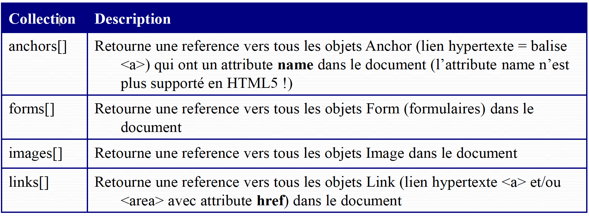
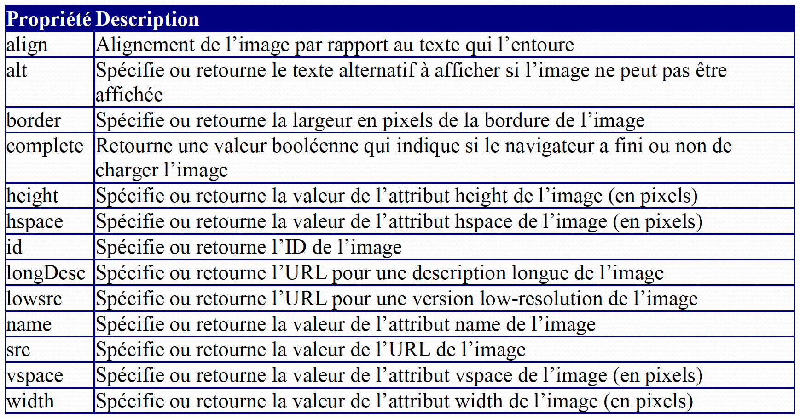

# Résumé cours javascript Master CIM
## Cours 1

JavaScript
* Est un langage de programmation interprété
* Est un langage de script qui permet d’écrire des
scripts du coté client
* Permet d’animer les pages Web en utilisant
DHTML (Dynamic HTML)
* Permet de répondre aux actions de l’utilisateur
* Est un langage de programmation orienté objet

### Notions de base du langage JS
* Java Script contient :
    * Des mots clés
        * Fonctions natives : escape(), eval(), isFinite(), isNaN(),
parseFloat(), parseInt(), unescape(), …
        * Instructions : break, if, else, for, in, return, switch, while, with
        * Opérateurs : function, new, this, var, +, -, *, /, …
    * Des événements : onclick, onload, etc.
    * Des objets
        * Propriétés
        * Méthodes
### Conversion de types de données
* Conversion de chaînes de caractères en nombres
* Les fonctions :
    * parseInt("chaîne") – transforme la chaîne de caractères en entier
    * parseFloat("chaîne") - transforme la chaîne de caractères en réel
* Conversion de nombres en chaînes de caractères ?

### Chaînes de caractères
* Pour spécifier des guillemets vous pouvez aussi les
précéder d'un antislash (\)
* Pour spécifier un antislash littéral avant un guillemet simple ou à la fin d'une chaîne de caractères, écrivez-le
deux fois (\\)
    * \" -> "
    * \' -> '
    * \\ -> \
    * \n -> nouvelle ligne
    * \r -> retour chariot
    * \t -> tabulation

* La propriété length
    * Retourne la longueur d’une chaîne de caractères
    * Exemple :
```javascript
strCode="69003";
document.write(strCode.length);
```

* Modifier la casse
* **toLowerCase**()
    * Retourne la chaîne avec tous les caractères en minuscules
    * Exemple : `str2=str1.toLowerCase();`
 * **toUpperCase**()
    * Retourne la chaîne avec tous les caractères en majuscules
    * Exemple : `str2=str1.toUpperCase();`

* Recherche de sous-chaînes
* Integer **chaine.indexOf(String souschaine[, Integer debut])**
    * Retourne la position d'une sous-chaîne souschaine dans une chaîne, à partir de la position debut. Si la sous-chaîne n'est pas trouvée, indexOf() retourne -1. Sensible à la casse.
    * Si debut absent, par défaut il a la valeur 0.
* **Integer chaine.lastIndexOf(String souschaine)**
    * Retourne l'indice de la dernière occurence de souschaine.
    * Si souschaine n'est pas trouvée, lastIndexOf() retourne -1.
* **String chaine.slice(Integer debut [, Integer fin])** ou
* **String chaine.substring(Integer debut [, Integer fin])**
    * Extrait une sous-chaîne d'une chaîne en partant de l'indice debut et jusqu'à l'indice fin.
    * Si fin n'est pas précisé, la chaîne est extraite depuis le début jusque sa fin.
* **String chaine.substr(Integer debut, Integer longueur)**
    * Presque identique à **substring()**.
    * La seule différence tient dans le second paramètre qui indique le nombre de caractères à extraire.
 
### Détecter la version du navigateur
* JavaScript peut être utilisé pour détecter la version du
navigateur et, éventuellement, charger des pages
différentes en fonction de cette version
* L’objet navigator, à travers ses propriétés, permet aux
scripts d’accéder aux informations relatives à la version
en cours du navigateur


Propriété | Description | Pour votre navigateur
| :------------ | :------------- | :-------------: |
| appCodeName       |     retourne le nom de code du navigateur. Un navigateur a généralement pour nom de code Mozilla, le moteur utilisé par la plupart des navigateurs (Internet explorer, Firefox, mais aussi beaucoup de navigateurs sous Unix...). Cette valeur sera différente si le navigateur du client est basé sur un autre moteur (e.g. Opera, ...).     |        Mozilla |
| appName     |   retourne le nom du navigateur (la plupart du temps la marque)    |      Netscape|
| appVersion        |     retourne la version du navigateur. Cette propriété prend la forme suivante : Numéro de version (plateforme (système d'exploitation), nationalité) Elle est utile pour connaître le système d'exploitation de l'utilisateur,mais surtout, associée avec la propriété navigator.appName elle permet de connaître les fonctionnalités que supporte le navigateur de votre visiteur.      |         5.0 (Windows; fr) |
| language        |     renvoie une chaîne de caractère donnant la langue utilisée par le navigateur du client. Pour les navigateurs supportant les versions 1.2 et supérieures de Javascript.      |         fr |
| cookieEnabled        |     Retourne une valeur booléenne qui spécifie si les « cookies » sont activés dans le navigateur client      |         true |
| mimeTypes        |     Cette propriété renvoie un tableau répertoriant les types MIME supportés par le navigateur, c'est-à-dire les types de fichiers enregistrés.      |         [object MimeTypeArray] |
| platform        |          |         Win32 |
| plugins        |    List des plugins sous forme de tableau       |          |
| userAgent        |    chaine de carractrere qui contient les information du navigateur       |         true |

### Exemple – affichage propriétés de l'objet navigator

```javascript
 document.write("Browser CodeName: " + navigator.appCodeName);
 document.write("<br /><br /> Browser Name: " + navigator.appName);
 document.write("<br /><br /> Browser Version: " + navigator.appVersion);
 document.write("<br /><br /> Cookies Enabled: " + navigator.cookieEnabled);
 document.write("<br /><br /> Platform: " + navigator.platform);
 document.write("<br /><br /> User-agent header: " + navigator.userAgent);
 document.write("<br /><br /> language: " + navigator.language);
 document.write("<br /><br /> MIME Types: " + navigator.mimeTypes);
 document.write("<br /><br /> User Agent: " + navigator.userAgent); 
 ```

### Détecter la taille de l’écran
* L’objet **_screen_** donne des informations relatives à l'écran de l'utilisateur

Propriété | Description | 
| :------------ | :-------------: |
| **availHeight** | spécifie la hauteur de l'écran en pixels moins les particularités  d'interface du système comme la barre des tâches.|
| **availWidth** | spécifie la largeur de l'écran en pixels moins les particularités d'interface du système comme la barre des tâches.|
| **colorDepth** | donne la profondeur (en bits) de la palette de couleurs du navigateur.|
| **height** | indique la hauteur de l'écran.|
| **pixelDepth** | affiche la résolution en couleur de l'écran (en bits/pixel).|
| **width** | indique la largeur de l'écran.|

### L’objet window
* L'objet **_window_** est le parent de chaque objet qui
compose la page web. Il contient :

    * l'objet **_document_** : la page en elle-même
    * l'objet **_location_** : le lieu de stockage de la page
    * l'objet **_history_** : les pages visitées précédemment
    * la collection **_frames_** : les cadres (division de la fenêtre en sous-fenêtres)

### Le moment où le script s’exécute
* Facteur déterminant : l’endroit où les scripts sont placés
dans un document
    * Au chargement d’un document
        * dans la partie body
    * Juste après le chargement
        * événement onLoad dans la balise body, appel de fonction JavaScript (fonction qui est définie avant, dans la partie head, ou dans un fichier externe déclaré dans la partie head)
    * En réponse d’une action utilisateur
        * événement + appel fonction JavaScript
    * Quand il est appelé par d’autres instructions de script

### JavaScript et les chaînes de caractères
* Objet « String »
* Exemples :
```javascript
var valeur = 'test';
var chaine = new String(valeur) ;
var chaine1 = "Bonjour !" 
``` 
* Propriété de l’objet String : length
* Exemples :
```javascript
var longeur = chaine.length;
var longeur1 = ("Bonjour !").length;
```
### Méthodes de l’objet String - rappel
(liste non-exhaustive !)
* **toLowerCase(chaine)** – convertit la chaîne en minuscules
* **toUpperCase(chaine)** - convertit la chaîne en majuscules
* **charAt(position)** – retourne le caractère qui se trouve à la position spécifiée
* **charCodeAt(position)** – retourne un nombre qui représente la valeur du code Unicode du caractère qui se trouve à la position spécifiée
* **indexOf(valeur, debut)** – recherche une sous-chaîne de caractères dans l’objet String, à partir de la position debut
* **_lastIndexOf(valeur, debut)_** – recherche de la dernière apparition d’une
sous-chaîne de caractères
* **substr(debut, longueur)** – retourne une sous-chaîne de caractères
* **substring(debut, fin)** – retourne une sous-chaîne de caractères
* Utilisation : `objet.methode()`
* Exemple : `chaine.toUpperCase()`

### Tableaux
*Création d’un tableau :
* var tabJours = new Array(7);
* ou avec initialisation des éléments : 
```javascript
var tabJours = new Array(" Lun ", " Mar ", " Mer ", " Jeu ", " Ven ", " Sam "," Dim ");
```
* Indices : de 0 à 6
* Accès à un élément de tableau : tabJours[0]
* Taille du tableau : tabJours.length
* Exemple : afficher tous les éléments du tableau :
```javascript
for(i=0; i< tabJours.length; i++){
document.write(tabJours[i]+" ");
}
```
### L’objet _**document**_
* Représente la page HTML et donne accès à tous ses
éléments
* Ensembles d’objets :



### Accès à un formulaire
Script qui affiche le nombre de formulaires existants dans une page web
```html

 <html>
     <body>
         <form name="formulaireContact">…</form>
         <form name="formulaireRecherche">…</form>
         <script type="text/javascript">
            document.write("Le document contient : ");
            document.write(document.forms.length + "formulaires.")
         </script>
     </body>
 </html>
 
 ```
* Attention : « document.forms » est un tableau
* Pour accéder par exemple au premier formulaire de la page utilisez : ` document.forms[0]`

* Avec un numéro d'index
    * Exemple : `document.forms[index]`
        * Le premier formulaire avec forms[0], le deuxième avec forms[1] etc... dans l'ordre dans lequel les balises <form> apparaissent dans le fichier
* Avec le nom du formulaire comme index
    * Exemple : `document.forms["nomFormulaire"]`
        * où nomFormulaire est la valeur de l'attribut name= dans la balise `<form>`
* Directement avec le nom du formulaire
    * Exemple : document.nomFormulaire
    * où nomFormulaire est la valeur de l'attribut name dans la balise `<form>`

### Accès aux éléments d’un formulaire
* Pour accéder aux éléments du formulaire (à des champs de saisie, des boutons etc.) utilisez l'objet elements
* Avec un numéro d'index
    * Exemple : `document.forms[indexForm].elements[indexElement]`
* Avec le nom de l’élément (de la balise)
    * Exemple : **_document.nomFormulaire.nomElement_**
        * où nomFormulaire et nomElement sont les noms du formulaire et de l'élément dans les balises HTML correspondants (attribut name)

### L’objet «document »
* Méthodes

Propriété | Description | 
| :------------ | :-------------: |
| **getElementById()** | Retourne l’adresse du premier objet qui a l’identifiant (id) spécifié| 
| **getElementsByName()** | Retourne une collection (un tableau) d’objets qui ont le nom (name) spécifié |
| **getElementsByTagName()**|Retourne une collection (un tableau) d’objets qui ont la balise spécifiée|
| **write()**|Ecrit une chaîne de caractères dans un document|

### Exemple 1
```html
<html>
    <body>
        <p id="intro">Bonjour !</p>
        <script type="text/javascript">
            txt=document.getElementById("intro").innerHTML;
            document.write("<p>Le texte du paragraphe id=intro : " + txt + "</p>");
        </script>
    </body>
</html>
```

### Exemple 2

```html
<html>
    <head>
        <script>
        function changeLien(){
            document.getElementById('monAdr' ).innerHTML ="Voir
            document.getElementById('monAdr').href ="http://www.google."
        }
        </script>
    </head>
    <body>
        <a id="monAdr" href="http://www.yahoo.com">Voir Yahoo</a>
        <br> <br>
        <input type="button" onclick="changeLien()" value="Change lien">
    </body>
</html>

```

### L’objet «style »

* L'objet « **style** » représente une déclaration de style

* L'objet « **style** » est accessible à partir de l’objet
« **document** » ou des éléments aux quels ce style est appliqué

* Exemple de syntaxe :
    * **document.getElementById("id").propriété="valeur"**

L’objet «style »
* Les propriétés disponibles sont celles que vous utilisez en CSS

* Convention pour les noms par rapport aux propriétés CSS :

* Si un seul mot, il est le même en JavaScript (DOM)

* Si deux ou plusieurs mots, ils sont collés (sans trait d’union) et la
première lettre à partir du 2ème mot est une majuscule

* Exemple :

```javascript
document.style.color; // la couleur du texte du document
document.getElementsByTagName("ul")[i].style.listStyleType="square";
```
### L’objet «image »
* Il existe un objet « **image** » dans le DOM pour chaque image insérée dans un document HTML




### Body – événement **_onload_**
Permet d'effectuer des actions dés le chargement de la page Web

```html

 <html>
     <head>
         <script type="text/javascript">
             function charge(){
             alert("Page chargée");
             }
         </script>
     </head>
     <body onload="charge()">
        <h1>Bonjour !</h1>
     </body>
 </html>
 
 ```

### Construire/Modifier le texte de la page
 Ajout d'un paragraphe de texte à une page qui contient un titre (`<h1>`) et un hyperlien (`<a>`)
 
```html
 <html>
      <head>
          <script type="text/javascript">
              function affiche(){
                  //recupere le texte de la page
                  textePage=document.body.innerHTML;
                  //modifie le texte (ajout d'un paragraphe)
                  textePage=textePage + '<p>Nouveau paragraphe ajouté au moment du chargement de la page</p>';
                  //remplace le texte de la page avec le nouveau texte
                  document.body.innerHTML = textePage;
              }
          </script>
      </head>
      <body onLoad="affiche()">
        <h1>Site officiel JavaScript</h1>
         <a href="http://www.javascript.com/">JavaScript</a>
      </body>
</html>
```

### Affichage d'une liste dans une boucle
 Affichage d'une liste à puces de 10 items : item1, item2, …, item10
 ```html
 
 <html>
     <head>
         <script type="text/javascript">
             function affiche(){
                 //modifie le texte (ajout d'une liste de 10 items : item1, item2, …, item10)
                 textePage='<ul>';
                 for(i=1; i<=10; i++){
                    textePage=textePage + '<li>Item '+i+'</li>';
                 }
                 textePage=textePage+'</ul>';
                 //placer la liste dans la page
                 document.body.innerHTML = textePage;
             }
         </script>
     </head>
     <body onLoad="affiche()">
     </body>
 </html>
 
 ```
